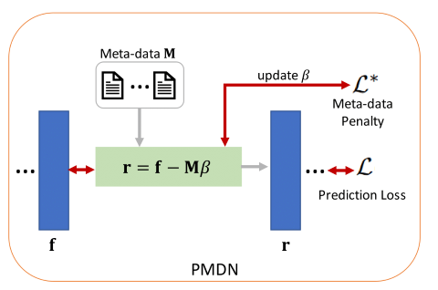

# PMDN
[**A Penalty Approach for Normalizing Feature Distributions to Build Confounder-Free Models**](https://arxiv.org/abs/2207.04607)\
Anthony Vento, Qingyu Zhao, Robert Paul, Kilian M. Pohl, Ehsan Adeli\
[MICCAI 2022](https://conferences.miccai.org/2022/en/)

| Video Presentation                                                                                                | Poster PDF                                                                                                |
|------------------------------------------------------------------------------------------------------------|--------------------------------------------------------------------------------------------------------------------|
| [](https://www.youtube.com/watch?v=qe-Py6BqCO4) | [](https://drive.google.com/file/d/1zGk1lOPvs2IdNmWxs08QeIG6tkAao-6h/view?usp=sharing) |

## Training
To train the models, run:

```train
python src/train.py
```

